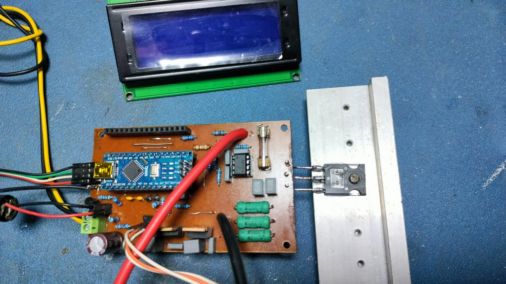
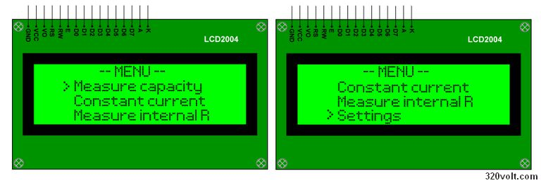
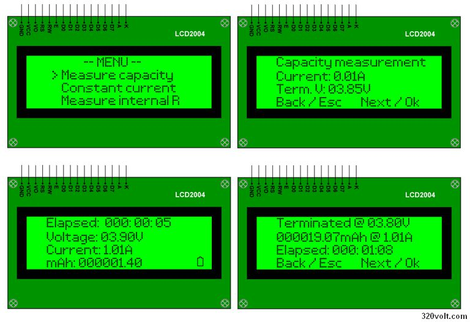
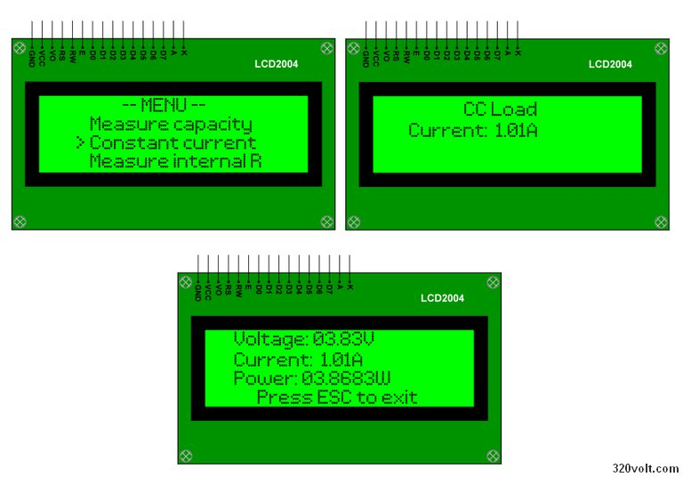
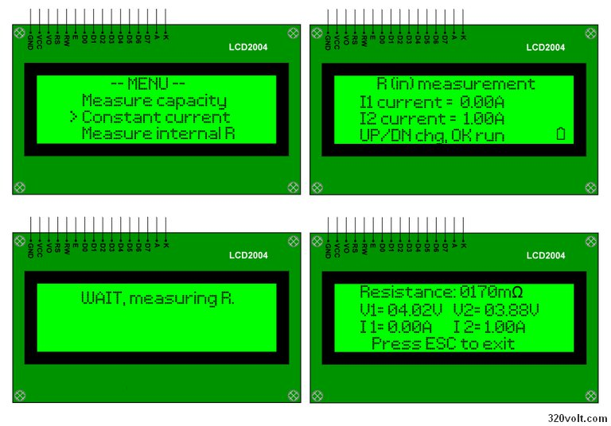
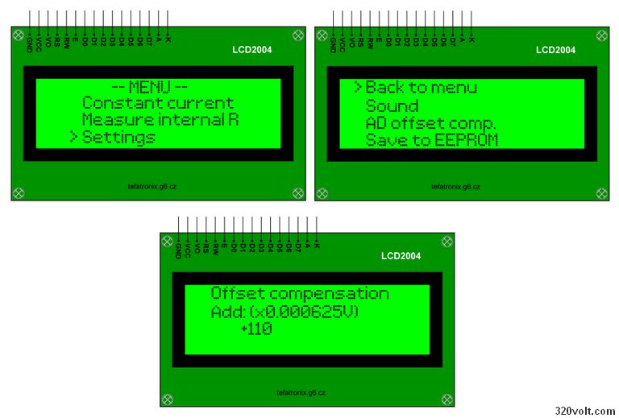
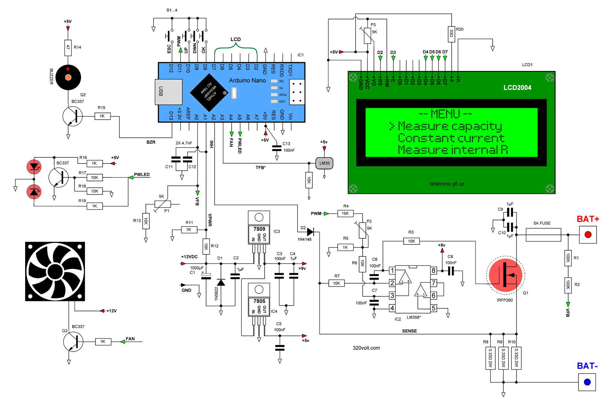
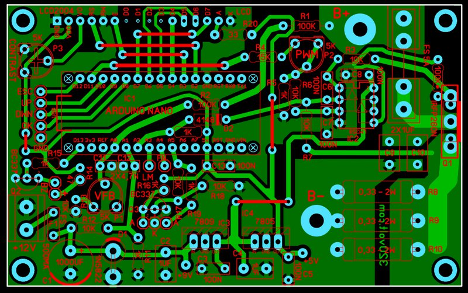

# Arduino Battery Analyzer

This project is an Arduino-based battery analyzer designed for measuring battery capacity and estimating internal resistance + constant current. It can be used not only for single-cell 18650 Li-ion batteries, but also for other rechargeable batteries and battery packs up to approximately 20 V, depending on the voltage divider, load resistor, MOSFET, cooling, and calibration settings.

Related article/project page:
https://320volt.com/arduino-pil-analiz-cihazi

## Features

* Power requirements: 12 V, 250 mA
* Input voltage: 0.8-20 V, measurement resolution 0.01 V
* Can be adapted for other batteries or battery packs up to approximately 20 V
* Battery  Capacity meter
* Constant current load
* Internal resistance meter
* Discharge current: 0,01-2,55 A
* Control: 4 buttons, 20x4 character LCD
* LM35 Fan control (optinal)

## LCD Menu and Measurement Screens

The project uses a 20x4 character LCD screen for menu navigation, capacity measurement, constant current load testing, internal resistance measurement, and device settings.

### Main Menu

### Capacity Measurement

This mode is used to discharge the connected battery with a selected current and calculate the measured capacity.

### Constant Current Mode

This mode allows the circuit to operate as a constant current electronic load.

### Internal Resistance Measurement

This mode estimates the internal resistance of the battery by comparing voltage values under different load current conditions.

### Settings Menu

The settings menu includes options such as sound, ADC offset compensation, and saving calibration values to EEPROM.

## Hardware

* Arduino Nano / ATmega328P
* Battery holder or external battery connection terminals
* Load resistors
* MOSFET driver circuit
* LCD screen
* Voltage measurement divider circuit
* Current measurement circuit
* Cooling fan for load resistors and MOSFET

## Schematic

The schematic below shows the Arduino Nano connections, LCD interface, voltage divider, MOSFET load stage, current sensing section, buzzer, fan output, and power supply regulators.

## PCB Layout

The PCB layout includes the Arduino Nano, LCD connector, MOSFET load section, resistor load bank, voltage measurement input, current sense path, fan output, and power supply section.

## Important Note

This project is for educational and testing purposes only. When working with Li-ion batteries, lead-acid batteries, NiMH packs, or other rechargeable batteries, caution must be exercised against short circuits, overcurrent, reverse polarity, overheating, and incorrect voltage divider calibration.

For battery voltages higher than a single Li-ion cell, the voltage divider, load resistor power rating, MOSFET voltage/current rating, heat dissipation, and firmware calibration values must be checked and adjusted before use.

The maximum usable battery voltage depends on the voltage divider ratio, ADC input limits, MOSFET rating, load resistor power rating, fuse rating, PCB trace current capacity, and cooling performance.

## Credits

Original project:
https://tefatronix.g6.cz/display.php?page=batmeter

Original author:
F. Štefanec

Related article/project page:
https://320volt.com/arduino-pil-analiz-cihazi

This Arduino Nano version is based on / adapted from the original rechargeable battery analyzer project.
